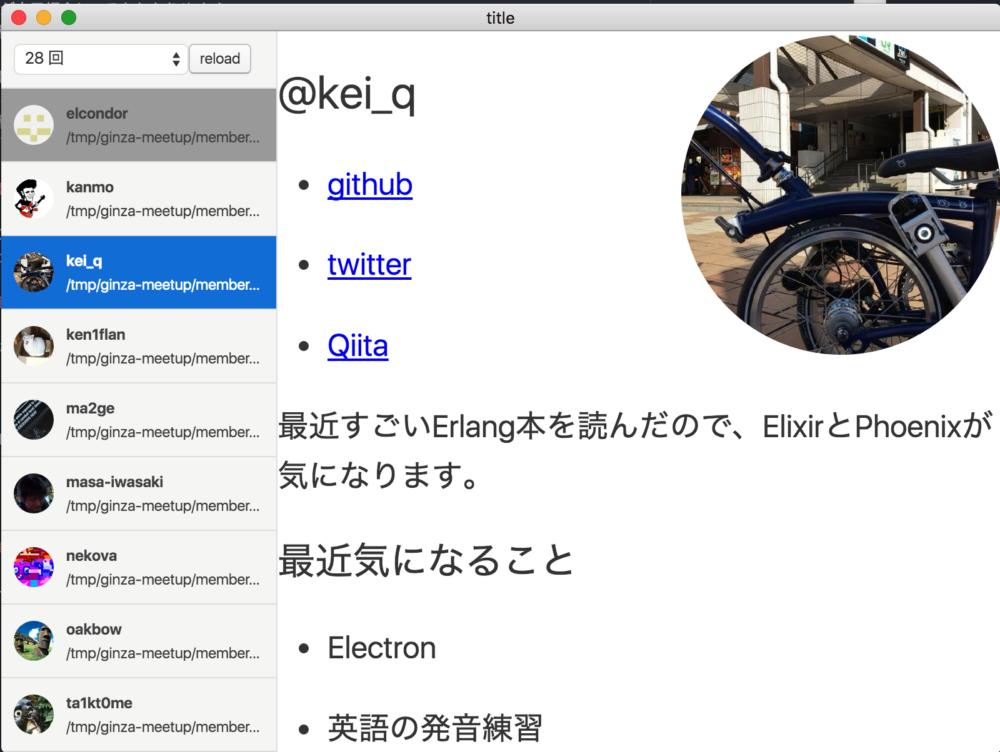

# ginzarb-meetup-viewer

これは https://github.com/ginzarb/meetups を見るためのアプリです。
ginzarbの最初に行う自己紹介時間に使うことを想定して作成しています。

## screenshot



## 機能

- meetupsのrepositoryをcloneしてきてmarkdownを表示
- githubのアイコンを表示
  - 誰が自己紹介してるかわかりやすく
- 自己紹介一覧
  - 自己紹介文を行ったり来たりするのを簡単にできるように
- 当日に自己紹介文を投稿した人もカバー
  - 簡易的な既読管理・当日にmergeされた自己紹介を再取得
- 自己紹介文の文字サイズを変更（keyboardの+と-）
  - 画面の大きさが会場やプロジェクターで変わっても調整できるように

## 必要なもの

- コマンドラインで`git`が実行できること
- `git clone`できる環境であること

## 開発手順

動作には`node`と`electron-prebuilt`が必要です。

```sh
$ git clone https://github.com/keqh/ginzarb-meetup-viewer
$ cd ginzarb-meetup-viewer
$ npm install
$ npm run dev
```

## 背景

ginzarbでは事前に自己紹介文を投稿し、一番初めに全員でそれを見ながら
